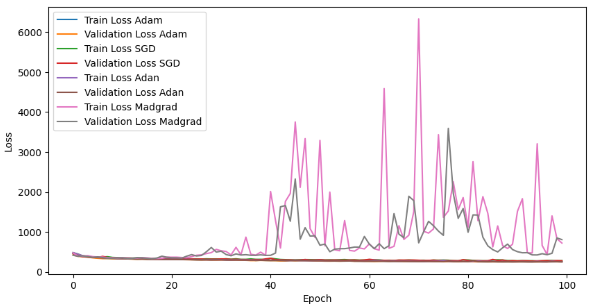
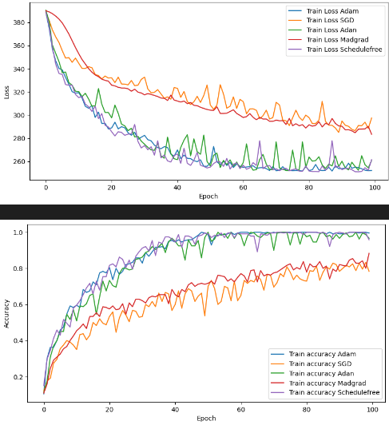
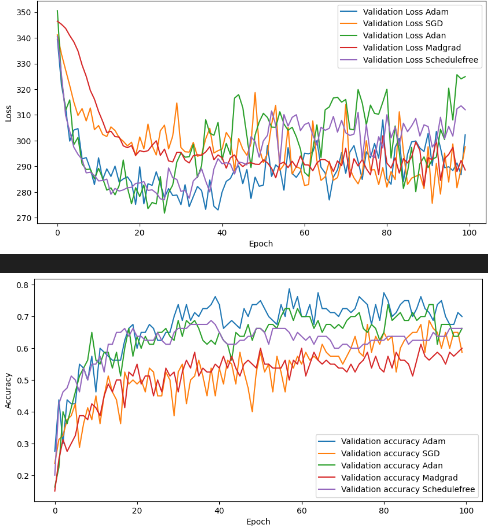
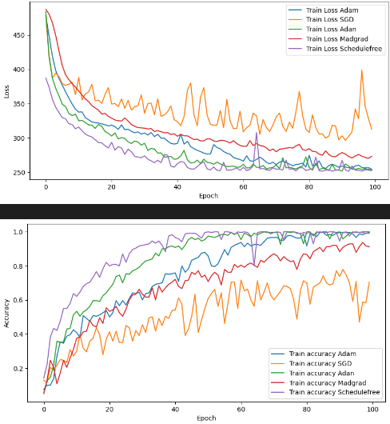
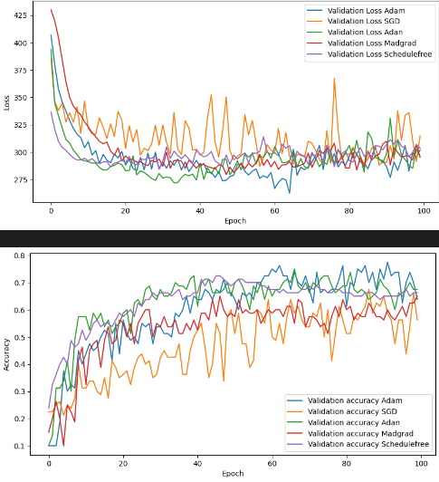
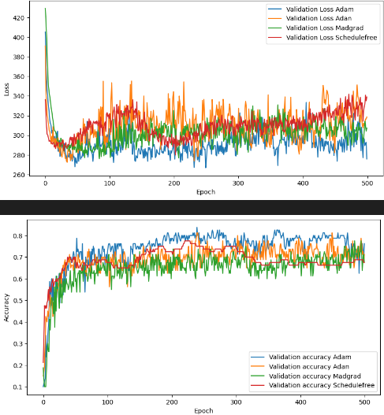

# 046211 modern optimizers for multiclass tasks
Welcome to the to our project repository.
This repository houses the code and resources for checking Adan, Madgrad, ScheduleFree new optimizers performances on Audio and image classifications tasks.
Our main goal is to check which optimizer perform the best for those task validating their articles.
Every optimizer show state of the art performance for many common tasks.

## Overview
In the recent years, new optimization methods arise.
While Adam is well known and used, different optimization technique claims that they are superior for specific cases.

- Adan - (https://arxiv.org/pdf/2208.06677) uses nestrov acceleration differently show Sota results for vision transformer, bert and gpt and promsing results for RL method.
    Further download and documentation is here: (https://github.com/lucidrains/Adan-pytorch/tree/main)

- Madgrad - (https://arxiv.org/pdf/2101.11075) - uses dual-averaging method which average the gradients over time. With that it should be more stable and converge better. 
    Further download and documentation is here: (https://github.com/facebookresearch/madgrad)

- Schedule free - (https://arxiv.org/pdf/2405.15682) Is a new scheduling technique using many optimization technique as adaptability, averaging, nestrov acceleration.

    It doesnt need scheduling time to be set in order reach very good performances vs other scheduling technique. 

## Methodology
In this project, we tested the optimizers credability for NLP task and vision task.
We tested SGD, Adam, Madgrad, Adan and ScheduleFree with the 2 tasks and checked if loss and accuracy is behave as the article suggest.

We chose the following tasks:
-  ECS-50 Audio Dataset for multiclass NLP classification using Hubert
-  Sport images dataset classification for vision task using pretrained ResNet-18

## Data

### ECS-50:
The datasets for the tasks include:
ECS - (https://github.com/karoldvl/ESC-50) 
- 50 classes of noise categories
- 40 audio records 
- 5 seconds each

We ran this project with only 10 classes (that are in ECS-10). In this github we can see the top models performances. 

By setting ONLY_10_LABELS=False in models/audio_ecs/utils would run the model with 50 classes rather then 10

### Sport-images:

The datasets for the tasks include:
Sports images dataset - (https://www.kaggle.com/datasets/ponrajsubramaniian/sportclassificationdataset) 
- Total of 14000 images
- 22 classes of different sports
- About 700 images in each class
- Each image can contain the ball, court, players or a combination of these objects.

## Model
### ECS-50 - 

We used well known model for audio named Hubert - (https://arxiv.org/pdf/2106.07447)

This is a transformer based on Bert using CNN for the first layers and projection after the end layers.

### Pretrained ResNet-18 - 

We tried many different models, but we opt to use the pretrained ResNet-18, while finetuning the last convolution and fully-connected layers. 

This adds up to above 8 million parameters. 

## Repository Structure
- **optimizers:** containing simple check we did with the optimizers
- **models:**  containing code for the two task - audio_ecs and imagenet
    - models/audio_ecs - folder for the audio task:
        - data_preperation - showing some analysis and details about the data
        - model - file to train the model
        - optimizers_optuna - file for optune optimizers hyperparameters for our specific task
        - utils - general functions used for the files above  

## How to Use
To utilize our earthquake prediction model, follow these steps:
1. **Clone the Repository:** Clone this repository to your local machine.
2. **Install Dependencies:** Ensure all necessary dependencies are installed.
3. **Prepare Data:** If using custom data, format it appropriately and replace the existing dataset.
4. **Run the Model:** Execute provided scripts in the `code` directory.
5. **Evaluate Results:** Examine predictions and evaluate model performance.

## Libraries Used
the Requirements.txt file in this repo can be used to download all of the required libraries.

## Results Summary

### Audio: 

#### First failure - Madgrad without gradient clipping perform really bad:

#### First Trail using hyperparameters:

#### Second Trail using hyperparameters:

#### Second Trail for more epochs:

### Images:

#### Train Results

As we can see from the training graphs all optimizers but Adan reach the 100% accuracy and 0 loss.
We can see that schedule free converged the fastest to 100% accuracy, followed by Adam, SGD and Madgrad. 

#### Test Results

From the validation graphs we can see how SGD performs the best while Adam under-performed significantly compared to the others. 
We can see that Madgrad performed on the same level as Adam. 
In the loss graphs for the validation, we can see how the optimizers reach the minimum point very early, this could be attributed to the model being pretrained. 

## Conclusion

### Audio
1. Gradient clipping​ for madgrad was crucial for optimizing hubert with it

2. SGD ​- under perform the other optimizers for this task

3. Train vs Validation – ​

    - train - Adan, Adam and scheduleFree​ - converge fast for this task

    - val - the optimizers reach a similar point 

4. Noise - Adam and scheduleFree were the most smooth - Madgrad and Adan were more noisy
for noisy optimizers we recommend for early stopping ​

5. Who is better? we didnt see a clear separation in the accuracy for the models– ​

    we can assume that as the articles says for different choice of optimizer 
    we may see better performance than Adam.
    so we recommend try using schedule free and Adan 

### Images
1. Train vs Validation – ​

    - train - ScheduleFree , SGD, Adam and Madgrad​ - converge faster for this task (in this order), while Adan failed to reach 100% accuracy.

    - val - SGD outperformed all other optimizers, while Madgrad reached the same level as Adam and ScheduleFree, and Adan under-performed.

2. Generalization - our chosen dataset was small and consists of images with many different features. This might have hurt when the model tried to generalize.

3. Who is better? We expect that with a different dataset that is larger and has more specific objects in it's images, Madgrad, Adan and ScheduleFree will perform better.

## Future Work

- **Training more for a simple task:**
    
    We would like to see a clear separation in the graphs for a specific task.  

    We couldn't match the amount of training for the 3 optimizers with our computation resources and maybe that is the reason why. 

    Training for a simple task but for many epochs would help to see any seperattion as in the article

- **Check image classification with specific objects:**

    Selecting a larger dataset with more specific objects in them could help the results.

## Contact
For inquiries or further information, please contact roy.weber@campus.technion.ac.il, tomer.rudich@campus.technion.ac.il
Thank you for your interest in our Optimizers project.